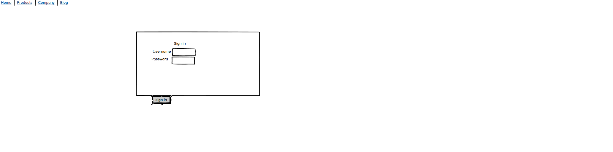
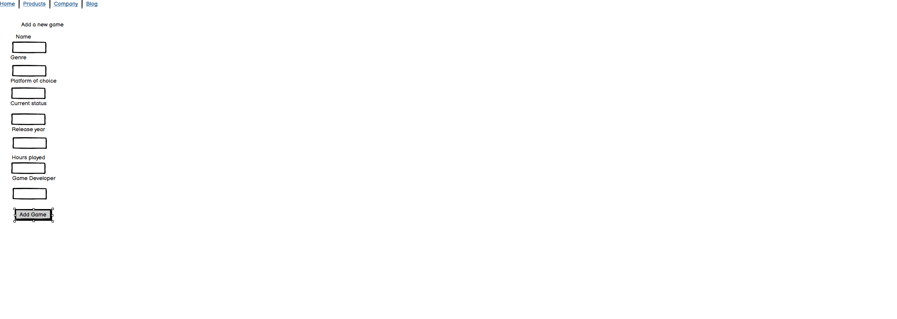
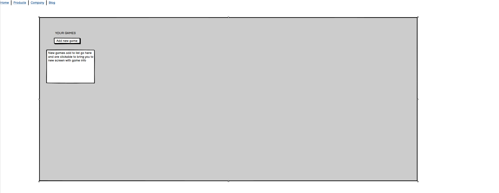
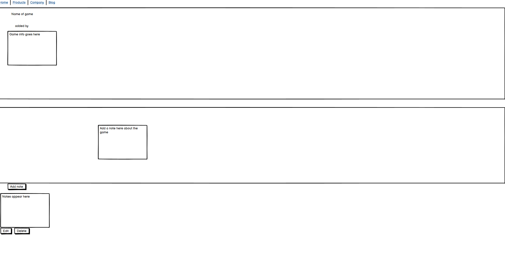

# Table of Contents

- [Table of Contents](#table-of-contents)
- [Overview](#overview)
- [UX Design](#ux-design)
- [User Stories](#user-stories)
- [Wireframes](#wireframes)
- [Brand Identity](#brand-identity)
- [Deployment](#deployment)
- [AI Usage Disclosure](#ai-usage-disclosure)
- [Testing](#testing)
- [Future Additions](#future-additions)

# Overview
[Back to Table of Contents](#table-of-contents)

[Visit the live site](https://keeptrackofyourgames-06c87bb2898e.herokuapp.com/accounts/login/)

Please find a link to the live project about this line. This project is called gametracker, its purpose is help gamers keep track
of what games they have in their backlog and what there playing and might want to play next. They can leave notes about the game there playing to remind them of stuff that they can go back and read about.

# UX Design

[Back to Table of Contents](#table-of-contents)

For the ux design I decided to keep it very simple. At the top of the page there is a nav bar with page options and they are 
Home About Register and Login, by clicking them you can navigate the different pages. When you first login in it will allow you to add a game, you can then click on the game and it will show you the game info. Also on this page you can leave a note about the game you're playing, e.g a part you found really cool or disliked or anything you want really. You can also delete and edit the comment. when you login it will bring you back to the login page and if you don't have an account you can sign up. When you sign in, it will tell you, you signed in as.... or if you delete a note it will ask you to confirm if you want to delete it. You will see small messages like this whenever an action is performed and its to give the user visual feedback of what they just did.

# User Stories
[Back to Table of Contents](#table-of-contents)
# Wireframes
Login in screen

Sign up screen

About me screen

Add a game

Game List

Game Info

[Back to Table of Contents](#table-of-contents)
# Deployment
[Back to Table of Contents](#table-of-contents)

The site is hosted on heroku and uses a PostgresSQL database, you can access the site through the live link at the top of the page or
follow these instructions if you want to run it locally on your machine.

Clone the repository:
git clone <your-repo-url>
cd gametracker

Create and activate a virtual environment:
python -m venv venv
source venv/bin/activate

Install dependencies: install dependancies from the requirements.txt
pip install -r requirements.txt

Apply Migrations
python manage.py migrate

Run the development server:
python manage.py runserver

Access Locally:
Open your browser and go to http://127.0.0.1:8000/
# AI Usage Disclosure
[Back to Table of Contents](#table-of-contents)
I used AI to help with debugging issues and errors, it was really helpful for this. I used it to help me break down problems further so I could write the code easier. It helped me with Django best practices and gave me ideas on how to make the user experience better for people using the site. It also helped with trying to understand complex error messages and point out what they meant and how to solve them. 

# Testing
[Back to Table of Contents](#table-of-contents)

# Technolgies used
- Python 3.11
- Django 4.x
- Bootstrap 5
- SQLite / PostgreSQL
- Heroku (for deployment)
[Back to Table of Contents](#table-of-contents)

# Future Additions
[Back to Table of Contents](#table-of-contents)

I would like to add a number of additions to the site in the future and these are:
- Add a backlog list 
- Add a playing now list
- Add a dropped games list
- Add a functional way where by the player can randomly select from their backlog what to play.
- Player can search other users and view their backlogs and leave comments.
- Sync steam achievements and playstation trophies so they can be listed on users profiles.

